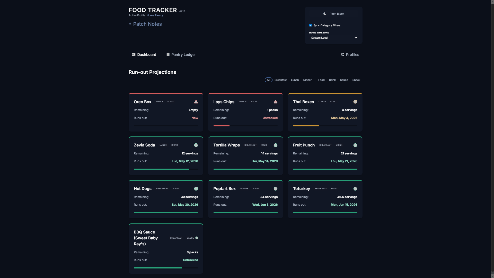
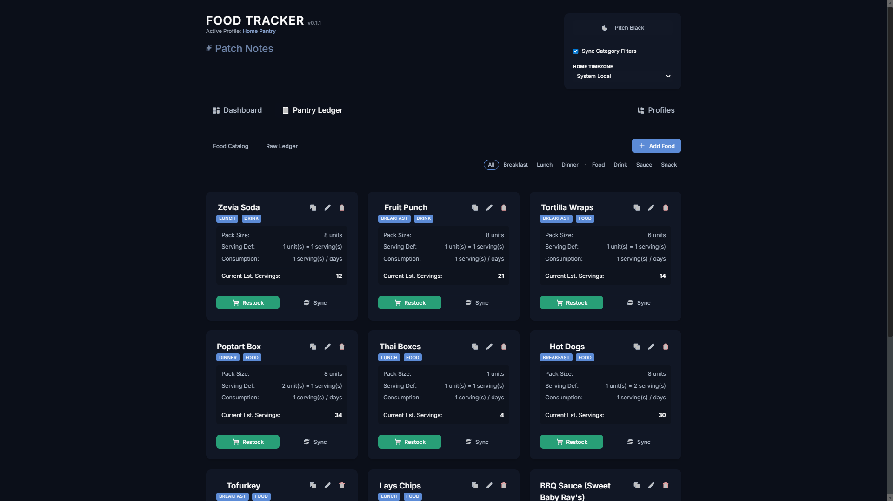
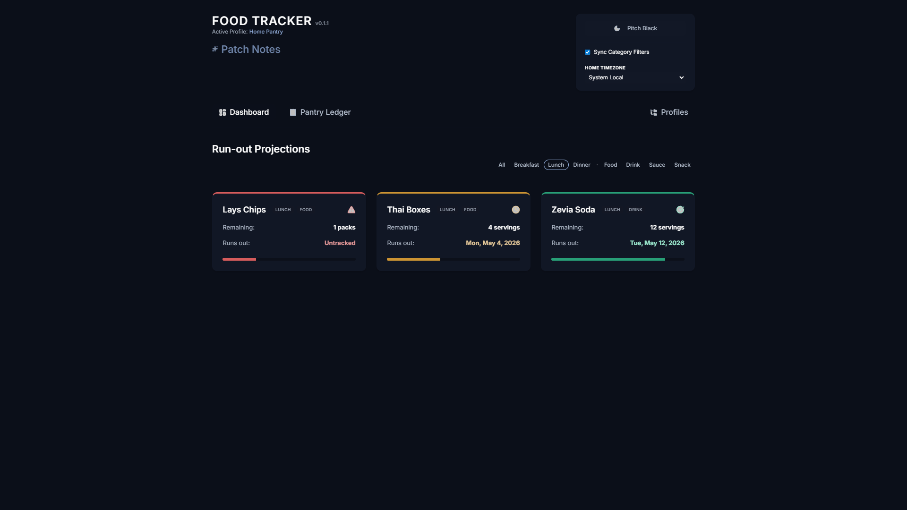
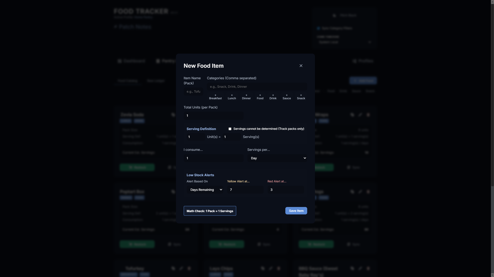

# Pantry Tracker: Smart Food Inventory Management

Pantry Tracker is a high-performance inventory management system designed to eliminate food waste and streamline your kitchen. Built with React and Vite, it features a sleek dark mode interface with real-time filtering and multi-profile support.

## Features

- **Pantry Dashboard**: Visual overview of your stock levels and category distribution.
- **Dynamic Ledger**: Track purchase dates, expiry status, and quantity levels with a clean, itemized view.
- **Smart Filtering**: Quickly filter your entire inventory by category (Produce, Dairy, Grains, etc.).
- **Multi-Profile Management**: Ported from FLOW, this system allows for multiple independent pantry save files and easy data sharing via codes.
- **System Local Sync**: Automatic timezone detection to keep your expiry dates accurate across devices.
- **Local Privacy**: All your food data is stored locally in `data.json`.

## Visual Preview






## Getting Started

### Prerequisites

- [Node.js](https://nodejs.org/) (v16 or higher recommended)

### Installation

1. Clone the repository:
   ```bash
   git clone https://github.com/Holyniwa/Pantry-Tracker.git
   ```
2. Navigate to the project directory:
   ```bash
   cd "Food Tracker"
   ```
3. Install dependencies:
   ```bash
   npm install
   ```

### Running Locally

To start the development server:
```bash
npm run dev
```

## Version History

Current Version: **v0.1.1**
Release Date: April 26, 2026
